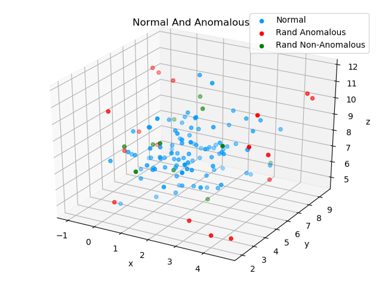

Multivariate Anomaly Detection

Dataset:
Configurable Multidimensional Gaussian Data

## Purpose
Experiment with non-labeled Anomaly Detection 

# Run
python Runner.py  

## Implementation
Mostly as described in Andrew NG's ML lectures for Anomaly Detection.  
1. Generate multidimensional normally distributed data.
2. Calculate means for all features
3. Calculate covariance matrix for the training data
4. Use 2 and 3 to calculate the probability for all training records
5. 4 uses the formula from Andrew Ng's Coursera Lecture on   
"Anomaly Detection with the Multivariate Gaussian":  
  
6. The fifth lowest probability amongst the training records is considered to be epsilon - the anomaly threshold  
7. If a record has a probability lower than epsilon,  
according to the the multivariate normal distribution fit during training,  
this record is considered anomalous.  

### Example Result from a Test Run
Blue Dot - Training Record  
Red Dot  - Random Anomaly  
Green Dot - Random Non-Anomaly  

### Web App Simulation    
At the time of this commit available at:  
http://boyko.io/tignis
